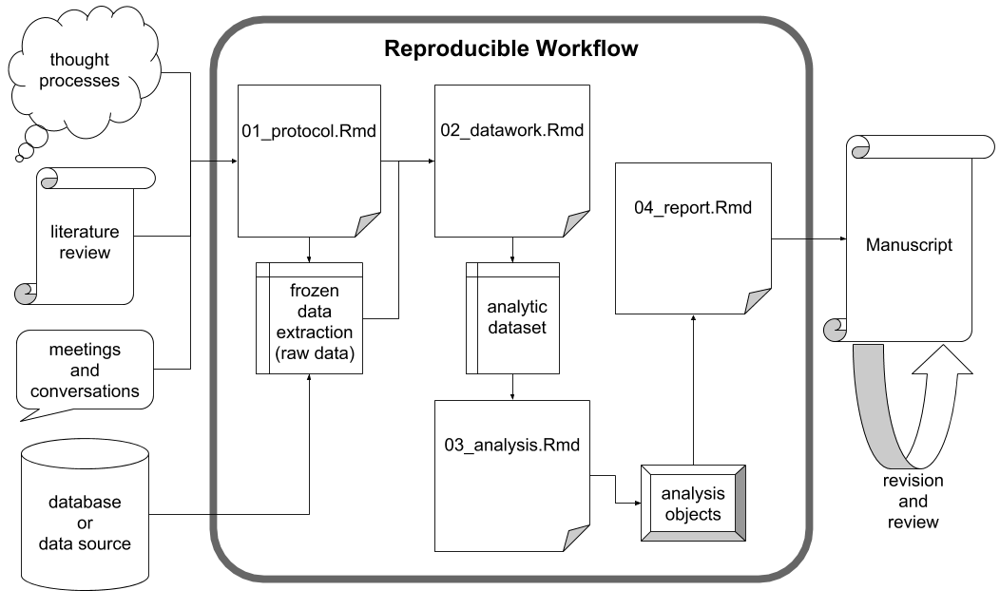

<!-- README.md is generated from README.Rmd. Please edit that file -->

# projects

[](https://cran.r-project.org/package=projects)


### Authors

Nikolas I. Krieger, M.S.;<sup>1</sup> Adam T. Perzynski,
Ph.D.;<sup>2</sup> and Jarrod E. Dalton, Ph.D.<sup>1,3</sup>

<sup>1</sup> Department of Quantitative Health Sciences, Lerner Research
Institute, Cleveland Clinic, 9500 Euclid Avenue (JJN3), Cleveland, OH,
44195  
<sup>2</sup> Center for Healthcare Research and Policy, Case Western
Reserve University at MetroHealth, 2500 MetroHealth Drive, Cleveland, OH
44109  
<sup>3</sup> Cleveland Clinic Lerner College of Medicine, Case Western
Reserve University

Acknowledgements:  
The authors of this package acknowledge the support provided by members
of the Northeast Ohio Cohort for Atherosclerotic Risk Estimation
(NEOCARE) investigative team: Claudia Coulton, Douglas Gunzler, Darcy
Freedman, Neal Dawson, Michael Rothberg, David Zidar, David Kaelber,
Douglas Einstadter, Alex Milinovich, Monica Webb Hooper, Kristen
Hassmiller-Lich, Ye Tian (Devin), Kristen Berg, and Sandy Andrukat.

Funding:  
This work was supported by The National Institute on Aging of the
National Institutes of Health under award number R01AG055480. The
content is solely the responsibility of the authors and does not
necessarily represent the official views of the National Institutes of
Health.

### Installation

You can install `projects` with:

``` r
install.packages("projects")
```

## Introduction

The goal of the `projects` R package is to provide a set of tools that
support an efficient project management workflow for statisticians and
data scientists who perform reproducible research within team science
environments. The `projects` package is built upon some existing tools
for reproducible research, particularly RStudio, the R integrated
development environment in which it dwells, and R Markdown, the file
structure that allows users to assemble datasets, to perform analyses
and to write manuscripts in a single file. The `projects` package is
oriented towards efficient and reproducible academic research manuscript
development and incorporates protocol and analysis templates based on
widely-accepted reporting guidelines (viz., CONSORT and STROBE). When
used on a shared file system (e.g., a server), the `projects` package
provides infrastructure for collaborative research: multiple researchers
can work on the same project and keep track of its progress without
having to request updates.

The primary features of the projects R package are the following:

  - Relational database containing details of projects, project
    coauthors and their affiliations, so that author details generally
    need to be entered only once;
  - Tools for editing metadata associated with projects, authors and
    affiliations;
  - Automated file structure supporting reproducible research workflow;
  - Report templates that automatically generate title page headers,
    including a numbered author list and corresponding affiliations;
  - Full RStudio integration via R Markdown, including customizable
    styling via cascading style sheets (CSS);
  - Customization, including the ability to add and to edit templates
    for protocols and reports, and the ability to change default project
    directory and file structures; and
  - Organization and management functionality, including the ability to
    group, archive and delete projects.

At its outset, the `projects` package creates a folder called
*/projects* in a user-specified location. This directory will contain
all research projects created and maintained by the user. The
*/projects* folder will also contain a relational database of the
research projects and the persons who contribute to them. The database
allows for users to input important metadata about the projects and
authors, including stage of research and contact information. Once this
higher-level folder is created, users run R functions to create
projects, each of which is given its own folder. New project folders
automatically include aptly named subfolders and templates in order to
guide the project workflow (e.g., a “data” subfolder; a “datawork” R
Markdown template). Right away, users can begin working on the research
project and edit the metadata of the project itself and its authors. To
lessen the burden of the mundane details of manuscript writing, the
`projects` package can output lines to the console that, when copied
into an R Markdown file, generates a title page with all relevant
authorship information of any given project. Finally, since users may
create dozens of projects over time, users can run functions to organize
their projects within grouping subfolders of the main */projects*
folder.

## Conceptual Framework: Reproducible Research Workflows

Reproducibility in research is the focus of the much debated replication
crisis and is therefore an increasingly central goal of the contemporary
scientific process. In addition to a final report of study results,
reproducible research processes include the entire workflow that the
researchers used to generate those results. Actively maintaining and
archiving this workflow is important to the evaluation and validation of
the research. If other researchers can follow the same workflow to
achieve the same results, it corroborates the results as scientific
knowledge. When results are not produced by the same workflow, however,
scientific knowledge is still advanced, as the workflow is shown not to
yield generalizable results. (Baker 2016)

There exist today widely available tools that aid with reproducible
research, such as R and other statistical programming languages, that
allow for precise documentation of some of the most detail-oriented
portions of a project workflow. Researchers can distribute their code
scripts alongside their results in order to communicate the integrity of
their data processing and analysis. Unfortunately, statistical
programming languages per se only contribute to research reproducibility
insofar as individual statistical programmers are able (1) to use these
tools effectively and (2) to integrate their own use of these tools with
their collaborators’ work—which may not necessarily be oriented towards
reproducibility.



Although researchers of different disciplines may operate in nuanced
ways, there are aspects of the project workflow that are common to most
investigations. First, studies are conceptualized and designed according
to a protocol that details the research questions and planned analyses.
Data are collected, manipulated (or “tidied”) in order to make data
analysis possible. The results of the analyses are compiled into a
report, and ultimately an academic manuscript is drafted and submitted
for wider distribution.

When navigating this workflow, researchers strive for reproducibility
wherever possible, but especially during the intermediate, data-focused
phases of the workflow. Readers of the final manuscript should have
access to the study data in its most unrefined state possible: a frozen
dataset. A frozen dataset is almost invariably a digital file or set of
files that standard data analysis software can process. Whereas study
data may have been initially collected in a non-digital manner, a frozen
data set represents the study data’s earliest state of simultaneous
digitization and consolidation. From this point forward through the
reporting stage, total reproducibility is expected. Thanks to modern
data analysis via statistical programming languages, a reader should be
able to exactly reproduce all data-derived results from the frozen data
set alone. With access to the exact scripts the researchers used to
produce their results, readers can scrutinize every function call
performed on the frozen data set and its descendants.

The middle stage of the assumed study workflow can be performed with
near perfect reproducibility, but the beginning and ending stages may
not. Researchers cannot document every thought process, literature probe
and informal conversation that contributes to the development of the
initial study protocol, but they should strive to document it as
meticulously as possible. Databases tend to be dynamic such that a given
analytic data set is merely a snapshot in time. As for the final stages
of project development, journals require that manuscripts adhere to
specific and unique stylistic guidelines and that they be digitally
submitted with file types that are not independently conducive to
reproducibility (e.g., *.pdf*). For instance, even as RStudio supports
the creation of submission-ready documents directly from frozen
datasets, the vast majority of project teams include experts who do not
use RStudio; therefore, the collaborative manuscript editing process
ultimately takes place in an environment (e.g., Microsoft Word) that
only supports total reproducibility with extraordinary effort. In light
of these realities, researchers must do their best during manuscript
creation, keeping the process in reproducible environments for as long
as possible and otherwise documenting significant changes and
alterations.

## The `projects` package

### Initial Setup

All projects that the user creates with the `projects` package—as well
as its infrastructure—reside in a main folder called */projects*. Users
need not manually create this directory, and in fact they are encouraged
not to manually manipulate any folders that the `projects` package
involves. Instead, users run the function `setup_projects()`, providing
the full file path of the directory in which the user wants the
*/projects* folder to reside.

### Metadata

Data about authors, institutional and/or department affiliations and
projects are stored in *.rds* files within the main */project*
directory, so that the user only needs to enter these details once
(unless, for example, a co-author changes their name or affiliations).
These data are also used to assemble title pages of reports, with
automatically generated author lists and lists of author affiliations.
We provide a complete example of this process below in the
**Demonstration** section below.

The main metadata tables accessible to the user are `projects()`,
`authors()` and `affiliations()`, via functions thusly named. Two
additional tables are internally created to keep track of associations
between authors and projects and between authors and affiliations (see
the **Internal Tables** section).

#### Projects Table Columns

  - `id` – an identification number, specifically an integer, unique
    among the other projects. This number can be used whenever needing
    to identify this project within `projects` package functions.
  - `title` – the title of the project. A nonambiguous substring of
    `title` (i.e., a substring that does not match any other project)
    can be used whenever needing to identify this project within
    `projects` package functions. This value is also printed in the YAML
    header of the “protocol” and “report” *.Rmd* templates that are
    automatically generated upon project creation.
  - `short_title` – an optional unique nickname for the project. A
    nonambiguous substring of `short_title` (i.e., a substring that does
    not match any other project) can be used whenever needing to
    identify this project within `projects` package functions. This is
    useful if users cannot remember the long, formal project `title` nor
    the project `id`.
  - `current_owner` – the `id` of the author who is responsible for
    taking action in order that work on the project may proceed further.
  - `status` – a short description of the status of the project. For
    example, it may elaborate on the value of `current_owner` and/or
    `stage`.
  - `deadline_type` – a simple description of the meaning of the date
    contained in the next field, `deadline`.
  - `deadline` – a date indicating some kind of deadline whose meaning
    is described in the previous field, `deadline_type`.
  - `stage` – one of six predefined stages of project development that
    the project is currently in: `c("1: design," "2: data collection,"
    "3: analysis," "4: manuscript," "5: under review," "6: accepted")`.
  - `path` – the full file path where the project folder is located.
  - `corresp_auth` – the `id` of the author who should be contacted for
    any correspondence relating to the project. This author’s name will
    be especially marked on automatically generated title pages for this
    project, and his or her contact information will be especially
    displayed there as well in a “Corresponding Author” section.
  - `creator` – the `id` of the author who initially created the
    project, or the value of `Sys.info()["user"]` if the author who ran
    `new_project()` did not enter a value.

#### Authors Table

  - `id` – an identification number, specifically an integer, unique
    among the other authors. This number can be used whenever needing to
    identify this author within `projects` package functions.
  - `given_names` – the given name or names of the author. A
    nonambiguous substring of `given_names` (i.e., a substring that does
    not match any other author) can be used whenever needing to identify
    this author within `projects` package functions. This is included in
    the automatically generated title pages of the projects associated
    with this author.
  - `last_name` – the last name or names of the author. A nonambiguous
    substring of `last_name` (i.e., a substring that does not match any
    other author) can be used whenever needing to identify this author
    within `projects` package functions. This is included after
    `given_names` in the automatically generated title pages of the
    projects associated with this author.
  - `title` – the job title of the author.
  - `degree` – the abbreviation(s) of the author’s academic degree(s).
    This is included after `last_name` in the automatically generated
    title pages of the projects associated with this author.
  - `email` – the email address of the author. This is included in the
    “Corresponding Author” section of the automatically generated
    title pages of projects whose `corresp_auth` field contains this
    author.
  - `phone` – the phone number of the author. This is included in the
    “Corresponding Author” section of the automatically generated
    title pages of projects whose `corresp_auth` field contains this
    author.

#### Affiliations Table

  - `id` – an identification number, specifically an integer, unique
    among the other affiliations. This number can be used whenever
    needing to identify this affiliation within `projects` package
    functions.
  - `department_name` – the department name of the affiliation. A
    nonambiguous substring of `department_name` (i.e., a substring that
    does not match any other affiliation) can be used whenever needing
    to identify this affiliation within `projects` package functions.
    This is included in the affiliations section of the automatically
    generated title page of projects associated with authors with this
    affiliation.
  - `institution_name` – the name of the overall institution of the
    affiliation. A nonambiguous substring of `institution_name` (i.e., a
    substring that does not match any other affiliation) can be used
    whenever needing to identify this affiliation within `projects`
    package functions. This is included after `department_name` in the
    affiliations section of the automatically generated title page of
    projects associated with authors with this affiliation.
  - `address` – the address of the affiliation. This is included after
    `institution_name` in the affiliations section of the automatically
    generated title page of projects associated with authors with this
    affiliation. It is also included in the “Corresponding Author”
    section of the title page when a project’s corresponding author has
    this affiliation as his or her primary (i.e., first) affiliation
    (see the **Internal Tables** section).

#### Internal Tables

In keeping with relational database theory, there are two *.rds* files
that keep track of the many-to-many relationships between projects and
authors and between authors and affiliations. Each has two columns,
`id1` and `id2`, that contain the `id` numbers of these items. Each row
of this table describes an association. Furthermore, the `projects`
package keeps track of the order in which these associations appear so
that the automatically generated title pages list authors and
affiliations in the correct order. Users are able to run functions to
reorder these associations as needed.

### Project File Structure

Users create individual project folders with the function
`new_project()`. The name of each project folder is of the form p*XXXX*,
where *XXXX* is the project’s `id` padded with 0s on the left side. When
a project folder is created, it is automatically populated with folders
and files as shown below:

  - */p*XXXX
      - */data*
      - */data\_raw*
      - */figures*
      - */manuscript*
      - */progs*
          - *01\_protocol.Rmd*
          - *02\_datawork.Rmd*
          - *03\_analysis.Rmd*
          - *04\_report.Rmd*
      - *p*XXXX*.Rproj*

The included subfolders serve to organize the project, while the *.Rmd*
files are templates that facilitate the user’s workflow.

### File Management

The goal of the `projects` package is to provide a comprehensive set of
tools managing project files in a way that is self-contained in R and
independent of the underlying operating system. On a daily basis,
researchers make, move, copy, delete and archive files. Through the
`projects` package, researchers can perform all these actions in an
organized manner with an automated file structure. In fact, users are
advised not to manipulate the */projects* folder and its content with
their operating system, so that the package does not lose track of these
files. Multiuser application of `projects` requires a server or an
otherwise shared directory where multiple users can access the
*/projects* folder. File-managing functions—along with all functions—are
demonstrated below in the **Demonstration** section.

### Other Features

The `projects` package supports style customization of manuscripts
through cascading style sheets (CSS). When a project is created, a file
called *style.css* is created alongside the *.Rmd* files in the */progs*
folder; users can customize their protocol and report by editing this
file. Users can also create their own template files for the datawork,
analysis, and manuscript *.Rmd* files. Lastly, the user is given the
option to make these *.Rmd* files BibTeX-ready for streamlined
bibliography creation.

There will be a future vignette on these supplemental topics.

# Demonstration

Upon installation, the `projects` package must be set up using
`setup_projects()`. The user is to input the file path of the directory
wherein the */projects* folder is to be located.

``` r
library(projects)
```

``` r
setup_projects("C:/")
#> "projects" folder restored at
#> C:/projects
```

As the message suggests, it is in the user’s best interest to add
affiliations, followed by authors and projects.

``` r
new_affiliation(department_name  = "Department of Physics",
                institution_name = "University of North Science",
                address = "314 Newton Blvd, Springfield CT 06003")
#> New affiliation:
#> # A tibble: 1 x 4
#>      id department_name     institution_name       address                 
#>   <int> <chr>               <chr>                  <chr>                   
#> 1     1 Department of Phys~ University of North S~ 314 Newton Blvd, Spring~
```

This affiliation has been successfully added to the “affiliations” table
in the `projects` relational database. The next code chunk creates a few
more affiliations (output not included).

``` r
new_affiliation(department_name  = "Impossibles Investigation Team",
                institution_name = "Creekshirebrook Academy of Thinks",
                address = "Let Gade 27182, 1566 Copenhagen, Denmark")
new_affiliation(department_name  = "Statistical Consulting Unit",
                institution_name = "Creekshirebrook Academy of Thinks",
                address = "196 Normal Ave, Columbus, OH ", id = 50)
```

Note that we chose a specific `id` number (50) for the affiliation
called the “Impossibles Investigation Team.”

Now we are ready to add authors to the “authors” table of the `projects`
database.

``` r
new_author(given_names = "Scott", last_name = "Bug", title = "Professor",
           affiliations = c(2, "Physics"), degree = "PhD",
           email = "scottbug@imPOSSible.net", phone = "965-555-5556")
#> New author:
#> # A tibble: 1 x 7
#>      id given_names last_name title    degree email              phone     
#>   <int> <chr>       <chr>     <chr>    <chr>  <chr>              <chr>     
#> 1     1 Scott       Bug       Profess~ PhD    scottbug@impossib~ 965-555-5~
#> 
#> New author's affiliations:
#> # A tibble: 2 x 4
#>   affiliation_id department_name      institution_name     address         
#>            <int> <chr>                <chr>                <chr>           
#> 1              2 Impossibles Investi~ Creekshirebrook Aca~ Let Gade 27182,~
#> 2              1 Department of Physi~ University of North~ 314 Newton Blvd~
```

Notice that in creating associations between Scott Bug and his
affiliations, we were able to enter both the `id` number of one of them
(2) and a substring of the `department_name` of the other (“Physics”).
Also notice that the email address was coerced to be lowercase.

Now we’ll add more authors (output not
included).

``` r
new_author(given_names = "Marie", last_name = "Curie", title = "Chemist",
           affiliations = "Unit", phone = "553-867-5309", id = 86)
new_author(given_names = "George Washington", last_name = "Carver",
           title = "Astrophysicist", degree = "MA, MPhil, PhD",
           affiliations = c(1, 2, 50), id = 1337)
new_author(last_name = "Archimedes", title = "Mathematician")
new_author(last_name = "Wu", given_names = "Chien-Shiung", title = "Physicist",
           affiliations = c("of North", "Statistical Consulting"),
           degree = "PhD", email = "wu@WU.wU")
```

Now that some authors and affiliations have been created, we can view
these tables:

``` r
authors()
#> # A tibble: 5 x 7
#>      id given_names    last_name  title     degree    email        phone   
#>   <int> <chr>          <chr>      <chr>     <chr>     <chr>        <chr>   
#> 1     1 Scott          Bug        Professor PhD       scottbug@im~ 965-555~
#> 2     2 <NA>           Archimedes Mathemat~ <NA>      <NA>         <NA>    
#> 3     3 Chien-Shiung   Wu         Physicist PhD       wu@wu.wu     <NA>    
#> 4    86 Marie          Curie      Chemist   <NA>      <NA>         553-867~
#> 5  1337 George Washin~ Carver     Astrophy~ MA, MPhi~ <NA>         <NA>
affiliations()
#> # A tibble: 3 x 4
#>      id department_name        institution_name        address             
#>   <int> <chr>                  <chr>                   <chr>               
#> 1     1 Department of Physics  University of North Sc~ 314 Newton Blvd, Sp~
#> 2     2 Impossibles Investiga~ Creekshirebrook Academ~ Let Gade 27182, 156~
#> 3    50 Statistical Consultin~ Creekshirebrook Academ~ "196 Normal Ave, Co~
```

Now we will showcase project creation:

``` r
new_project(title = "Achieving Cold Fusion", short_title = "ACF",
            authors = c("Bug", "Chien-Shiung", 86, 1337),
            current_owner = "Carver", corresp_auth = "Bug", stage = "1: design",
            deadline_type = "Pilot study", deadline = "2020-12-31",
            use_bib = TRUE)
#> 
#> Project 1 has been created at
#> C:/projects/p0001
#> # A tibble: 1 x 8
#>      id title    short_title status  deadline_type deadline   stage  path  
#>   <int> <chr>    <chr>       <chr>   <chr>         <date>     <fct>  <chr> 
#> 1     1 Achievi~ ACF         just c~ Pilot study   2020-12-31 1: de~ C:/pr~
#> 
#> New project's authors:
#> # A tibble: 4 x 7
#>   author_id given_names    last_name title     degree   email       phone  
#>       <int> <chr>          <chr>     <chr>     <chr>    <chr>       <chr>  
#> 1         1 Scott          Bug       Professor PhD      scottbug@i~ 965-55~
#> 2         3 Chien-Shiung   Wu        Physicist PhD      wu@wu.wu    <NA>   
#> 3        86 Marie          Curie     Chemist   <NA>     <NA>        553-86~
#> 4      1337 George Washin~ Carver    Astrophy~ MA, MPh~ <NA>        <NA>
#> 
#> Current owner:
#> # A tibble: 1 x 7
#>      id given_names       last_name title         degree        email phone
#>   <int> <chr>             <chr>     <chr>         <chr>         <chr> <chr>
#> 1  1337 George Washington Carver    Astrophysici~ MA, MPhil, P~ <NA>  <NA>
#> 
#> Corresponding author:
#> # A tibble: 1 x 7
#>      id given_names last_name title    degree email              phone     
#>   <int> <chr>       <chr>     <chr>    <chr>  <chr>              <chr>     
#> 1     1 Scott       Bug       Profess~ PhD    scottbug@impossib~ 965-555-5~
#> 
#> Creator: kriegen
```

Notice that since a `creator` was not specified, this field was
populated with the value of `Sys.info()["user"]`.

Among other files and folders, this line of code created the files
*01\_protocol.Rmd* and *04\_report.Rmd*, which both include code to
create a title page exhibiting a preformatted list of authors and their
affiliations.

Here is what the top of these files look like:

    ---
    title: "Achieving Cold Fusion"
    output:
      word_document: default
      html_document:
        css: style.css
    bibliography: p0001.bib
    ---
    
    **_Scott Bug, PhD;^1,2^\* Chien-Shiung Wu, PhD;^2,3^ Marie Curie;^3^ and George Washington Carver, MA, MPhil, PhD^1,2,3^_**
    
    | ^1^ Impossibles Investigation Team, Creekshirebrook Academy of Thinks, Let Gade 27182, 1566 Copenhagen, Denmark
    | ^2^ Department of Physics, University of North Science, 314 Newton Blvd, Springfield CT 06003
    | ^3^ Statistical Consulting Unit, Creekshirebrook Academy of Thinks, 196 Normal Ave, Columbus, OH 
    
    | \* Corresponding author
    |   Let Gade 27182, 1566 Copenhagen, Denmark
    |   965-555-5556
    |   scottbug@impossible.net
    
    | Funding:
    
    \pagebreak

Notice that the author order given to the `authors` argument in
`new_project()` command has been preserved. Also notice that Scott Bug
has been marked as the corresponding author, and his contact information
has been included. When knitted, this will be a proper title page.

Now a few more projects will be created:

``` r
new_project(title = "Weighing the Crown", short_title = "Eureka!", 
            authors = "Archimedes", current_owner = "Archimedes", 
            corresp_auth = "Archimedes", stage = 6)
new_project(title = "How I Learned to Stop Worrying and Love the Bomb",
            short_title = "Dr. Strangelove", authors = c("wu", 1), 
            creator = "wu", current_owner = "George", corresp_auth = "George",
            stage = "under review", deadline_type = "2nd revision",
            deadline = "2030-10-8", id = 1945,
            status = "debating leadership changes", path = "top_secret",
            make_directories = TRUE)
new_project(title = "Understanding Radon", short_title = "Rn86",
            authors = 86, creator = 86, corresp_auth = 86, stage = "3",
            status = "Safety procedures", protocol = "CONSORT", use_bib = TRUE)
```

Here is the list of all projects that have been created:

``` r
projects()
#> # A tibble: 4 x 11
#>      id title short_title current_owner status deadline_type deadline  
#>   <int> <chr> <chr>               <int> <chr>  <chr>         <date>    
#> 1     1 Achi~ ACF                  1337 just ~ Pilot study   2020-12-31
#> 2     2 Weig~ Eureka!                 2 just ~ <NA>          NA        
#> 3     3 Unde~ Rn86                   86 Safet~ <NA>          NA        
#> 4  1945 How ~ Dr. Strang~          1337 debat~ 2nd revision  2030-10-08
#> # ... with 4 more variables: stage <fct>, path <chr>, corresp_auth <int>,
#> #   creator <chr>
```

Projects, authors, and affiliations can all be edited with their
respective `edit_*()` functions. For example, we can add to and remove
affiliations from an author with:

``` r
edit_author(author = "Bug", affiliations = ~ + 50 - impossibles)
#> Edited author:
#> # A tibble: 1 x 7
#>      id given_names last_name title    degree email              phone     
#>   <int> <chr>       <chr>     <chr>    <chr>  <chr>              <chr>     
#> 1     1 Scott       Bug       Profess~ PhD    scottbug@impossib~ 965-555-5~
#> 
#> Edited author's affiliations:
#> # A tibble: 2 x 4
#>   affiliation_id department_name     institution_name      address         
#>            <int> <chr>               <chr>                 <chr>           
#> 1              1 Department of Phys~ University of North ~ 314 Newton Blvd~
#> 2             50 Statistical Consul~ Creekshirebrook Acad~ "196 Normal Ave~
```

When adding or removing affiliations/authors from an author/project, a
one-sided `formula` is used: it must begin with a tilde `~`, and
elements are added with `+` and removed with `-`. Elements can be
referred to by their `id` numbers or their names, as described above.

A formula is also used in the `authors` argument in `edit_project()`:

``` r
edit_project("Cold", title = "Cold Fusion Is Actually Impossible",
             authors = ~ "archi", stage = "accepted")
#> Edited project info:
#> # A tibble: 1 x 11
#>      id title short_title current_owner status deadline_type deadline  
#>   <int> <chr> <chr>               <int> <chr>  <chr>         <date>    
#> 1     1 Cold~ ACF                  1337 just ~ Pilot study   2020-12-31
#> # ... with 4 more variables: stage <fct>, path <chr>, corresp_auth <int>,
#> #   creator <chr>
#> 
#> Edited project's authors:
#> # A tibble: 5 x 7
#>   author_id given_names    last_name  title    degree   email       phone  
#>       <int> <chr>          <chr>      <chr>    <chr>    <chr>       <chr>  
#> 1         1 Scott          Bug        Profess~ PhD      scottbug@i~ 965-55~
#> 2         3 Chien-Shiung   Wu         Physici~ PhD      wu@wu.wu    <NA>   
#> 3        86 Marie          Curie      Chemist  <NA>     <NA>        553-86~
#> 4         2 <NA>           Archimedes Mathema~ <NA>     <NA>        <NA>   
#> 5      1337 George Washin~ Carver     Astroph~ MA, MPh~ <NA>        <NA>   
#> 
#> title: "Cold Fusion Is Actually Impossible"
#> 
#> 
#> **_Scott Bug, PhD;^1,2^\* Chien-Shiung Wu, PhD;^1,2^ Marie Curie;^2^ Archimedes; and George Washington Carver, MA, MPhil, PhD^1,2,3^_**
#> 
#> | ^1^ Department of Physics, University of North Science, 314 Newton Blvd, Springfield CT 06003
#> | ^2^ Statistical Consulting Unit, Creekshirebrook Academy of Thinks, 196 Normal Ave, Columbus, OH 
#> | ^3^ Impossibles Investigation Team, Creekshirebrook Academy of Thinks, Let Gade 27182, 1566 Copenhagen, Denmark
#> 
#> | \* Corresponding author
#> |   314 Newton Blvd, Springfield CT 06003
#> |   965-555-5556
#> |   scottbug@impossible.net
#> 
#> | Funding:
```

Here, the `title` and `stage` of the project have also been edited.
Notice that the default behavior of `edit_project()` is to reprint the
project `title` as well as the other elements of the title page. The
user can then copy and paste this header into the *01\_protocol.Rmd* and
*04\_report.Rmd* files.

Also notice that the default behavior when adding elements is to place
them before the last author (unless there was only one author). This
occurs **after** elements are removed, as specified by any minus signs
(`-`) in the `formula`.

Another function that affects author order and whose default behavior
reprints project title page information is `reorder_authors()`:

``` r
reorder_authors(project = "Cold Fusion", "George", "Bug", 86)
#> project info:
#> # A tibble: 1 x 11
#>      id title short_title current_owner status deadline_type deadline  
#>   <int> <chr> <chr>               <int> <chr>  <chr>         <date>    
#> 1     1 Cold~ ACF                  1337 just ~ Pilot study   2020-12-31
#> # ... with 4 more variables: stage <fct>, path <chr>, corresp_auth <int>,
#> #   creator <chr>
#> 
#> Reordered project authors:
#> # A tibble: 5 x 7
#>   author_id given_names    last_name  title    degree   email       phone  
#>       <int> <chr>          <chr>      <chr>    <chr>    <chr>       <chr>  
#> 1      1337 George Washin~ Carver     Astroph~ MA, MPh~ <NA>        <NA>   
#> 2         1 Scott          Bug        Profess~ PhD      scottbug@i~ 965-55~
#> 3        86 Marie          Curie      Chemist  <NA>     <NA>        553-86~
#> 4         3 Chien-Shiung   Wu         Physici~ PhD      wu@wu.wu    <NA>   
#> 5         2 <NA>           Archimedes Mathema~ <NA>     <NA>        <NA>   
#> 
#> title: "Cold Fusion Is Actually Impossible"
#> 
#> 
#> **_George Washington Carver, MA, MPhil, PhD;^1,2,3^ Scott Bug, PhD;^1,3^\* Marie Curie;^3^ Chien-Shiung Wu, PhD;^1,3^ and Archimedes_**
#> 
#> | ^1^ Department of Physics, University of North Science, 314 Newton Blvd, Springfield CT 06003
#> | ^2^ Impossibles Investigation Team, Creekshirebrook Academy of Thinks, Let Gade 27182, 1566 Copenhagen, Denmark
#> | ^3^ Statistical Consulting Unit, Creekshirebrook Academy of Thinks, 196 Normal Ave, Columbus, OH 
#> 
#> | \* Corresponding author
#> |   314 Newton Blvd, Springfield CT 06003
#> |   965-555-5556
#> |   scottbug@impossible.net
#> 
#> | Funding:
```

Importantly, `edit_author()`, `edit_affiliation()`, and
`reorder_affiliations()` do **not** reprint the title pages of all
affected projects. Fortunately, the user can reprint updated title pages
with the `header()` function:

``` r
edit_affiliation(affiliation     = "Impossibles",
                 department_name = "Pseudoscience Debunking Unit")
```

``` r
header(project = "Cold")

title: "Cold Fusion Is Actually Impossible"


**_George Washington Carver, MA, MPhil, PhD;^1,2,3^ Scott Bug, PhD;^1,3^\* Marie Curie;^3^ Chien-Shiung Wu, PhD;^1,3^ and Archimedes_**

| ^1^ Department of Physics, University of North Science, 314 Newton Blvd, Springfield CT 06003
| ^2^ Pseudoscience Debunking Unit, Creekshirebrook Academy of Thinks, Let Gade 27182, 1566 Copenhagen, Denmark
| ^3^ Statistical Consulting Unit, Creekshirebrook Academy of Thinks, 196 Normal Ave, Columbus, OH 

| \* Corresponding author
|   314 Newton Blvd, Springfield CT 06003
|   965-555-5556
|   scottbug@impossible.net

| Funding:
```

In order to organize projects, users can create subdirectories within
the main */projects* folder where individual project folders can dwell.
Among the examples above, this has already occurred with the project
with the nickname (i.e., `short_title`) “Dr. Strangelove” because on its
creation the arguments `path = top_secret` and `make_directories = TRUE`
were included. The latter argument must be `TRUE` if the desired path
does not already exist. Observe the `path` column among the existing
projects:

``` r
projects() %>% select(id, short_title, path)
#> # A tibble: 4 x 3
#>      id short_title     path                        
#>   <int> <chr>           <chr>                       
#> 1     1 ACF             C:/projects/p0001           
#> 2     2 Eureka!         C:/projects/p0002           
#> 3     3 Rn86            C:/projects/p0003           
#> 4  1945 Dr. Strangelove C:/projects/top_secret/p1945
```

Users can also create subdirectories with the function
`new_project_group()`:

``` r
new_project_group("Greek_studies/ancient_studies")
#> 
#> The following directory was created:
#> C:/projects/Greek_studies/ancient_studies
```

If a project has already been created, it can be moved **not** with
`edit_project()` but `move_project()`. Users can also copy projects
using `copy_project()`; everything in the copy will be the same except
its `id`, folder name (which, again, is based on its `id`), `path`
(which, again, is based on its folder name), and the name of its
*.Rproj* file (which has the same name as the folder name).

``` r
move_project("Crown", path = "Greek_studies/ancient_studies")
copy_project(project_to_copy = "Radon",
             path = "dangerous_studies/radioactive_studies/radon_studies", 
             make_directories = TRUE)
```

``` r
projects(c("Crown", "Radon")) %>% select(id, title, path)
#> # A tibble: 3 x 3
#>      id title            path                                              
#>   <int> <chr>            <chr>                                             
#> 1     2 Weighing the Cr~ C:/projects/Greek_studies/ancient_studies/p0002   
#> 2     3 Understanding R~ C:/projects/p0003                                 
#> 3     4 Understanding R~ C:/projects/dangerous_studies/radioactive_studies~
```

Projects can also be archived; they are moved into a subdirectory called
*/archive* that is at the same level as the project folder (*/p*XXXX)
before it was run. If this */archive* folder does not exist, it will be
created.

``` r
archive_project("Strangelove")
#> # A tibble: 1 x 11
#>      id title short_title current_owner status deadline_type deadline  
#>   <int> <chr> <chr>               <int> <chr>  <chr>         <date>    
#> 1  1945 How ~ Dr. Strang~          1337 debat~ 2nd revision  2030-10-08
#> # ... with 4 more variables: stage <fct>, path <chr>, corresp_auth <int>,
#> #   creator <chr>
#> 
#> The above project was archived and has the file path
#> C:/projects/top_secret/archive/p1945
```

When a project is archived, it is no longer included in `projects()`
output unless the user sets `archived = TRUE`.

``` r
projects() %>% select(id, short_title, path)
#> # A tibble: 4 x 3
#>      id short_title path                                                   
#>   <int> <chr>       <chr>                                                  
#> 1     1 ACF         C:/projects/p0001                                      
#> 2     2 Eureka!     C:/projects/Greek_studies/ancient_studies/p0002        
#> 3     3 Rn86        C:/projects/p0003                                      
#> 4     4 Rn86        C:/projects/dangerous_studies/radioactive_studies/rado~
projects(archived = TRUE) %>% select(id, short_title, path)
#> # A tibble: 5 x 3
#>      id short_title    path                                                
#>   <int> <chr>          <chr>                                               
#> 1     1 ACF            C:/projects/p0001                                   
#> 2     2 Eureka!        C:/projects/Greek_studies/ancient_studies/p0002     
#> 3     3 Rn86           C:/projects/p0003                                   
#> 4     4 Rn86           C:/projects/dangerous_studies/radioactive_studies/r~
#> 5  1945 Dr. Strangelo~ C:/projects/top_secret/archive/p1945
```

Lastly, affiliations, authors and projects can be deleted with the
`delete_*()` functions. Deleting an author is complete: doing so removes
the author from the `creator`, `current_owner` and `corresp_auth` fields
of all projects. Furthermore, deleting a project also deletes the entire
project folder. Use the `delete_*()` functions with caution.

``` r
delete_affiliation("north science")
#> # A tibble: 1 x 4
#>      id department_name     institution_name       address                 
#>   <int> <chr>               <chr>                  <chr>                   
#> 1     1 Department of Phys~ University of North S~ 314 Newton Blvd, Spring~
#> # A tibble: 1 x 4
#>      id department_name     institution_name       address                 
#>   <int> <chr>               <chr>                  <chr>                   
#> 1     1 Department of Phys~ University of North S~ 314 Newton Blvd, Spring~
#> The above affiliation was deleted.
delete_author(2)
#> # A tibble: 1 x 7
#>      id given_names last_name  title         degree email phone
#>   <int> <chr>       <chr>      <chr>         <chr>  <chr> <chr>
#> 1     2 <NA>        Archimedes Mathematician <NA>   <NA>  <NA> 
#> # A tibble: 1 x 7
#>      id given_names last_name  title         degree email phone
#>   <int> <chr>       <chr>      <chr>         <chr>  <chr> <chr>
#> 1     2 <NA>        Archimedes Mathematician <NA>   <NA>  <NA>
#> The above author was deleted.
delete_project("Crown")
#> # A tibble: 1 x 11
#>      id title short_title current_owner status deadline_type deadline  
#>   <int> <chr> <chr>               <int> <chr>  <chr>         <date>    
#> 1     2 Weig~ Eureka!                NA just ~ <NA>          NA        
#> # ... with 4 more variables: stage <fct>, path <chr>, corresp_auth <int>,
#> #   creator <chr>
#> # A tibble: 1 x 11
#>      id title short_title current_owner status deadline_type deadline  
#>   <int> <chr> <chr>               <int> <chr>  <chr>         <date>    
#> 1     2 Weig~ Eureka!                NA just ~ <NA>          NA        
#> # ... with 4 more variables: stage <fct>, path <chr>, corresp_auth <int>,
#> #   creator <chr>
#> 
#> The above project was deleted.
```

# Conclusions

The `projects` package provides a comprehensive set of tools for
reproducible team science workflows. Efficiency in project management,
including manuscript development, is facilitated by an internal database
that keeps record of project details as well as team members’
affiliations and contact information. For manuscripts, title pages are
automatically generated from this database, and a selection of
manuscript outlines compliant with reporting guidelines are available in
R Markdown format. We believe that the `projects` package may be useful
for teams that manage multiple collaborative research projects in
various stages of development.

# References

<div id="refs" class="references">

<div id="ref-baker20161">

Baker, Monya. 2016. “1,500 Scientists Lift the Lid on Reproducibility.”
*Nature News* 533 (7604): 452.

</div>

</div>
